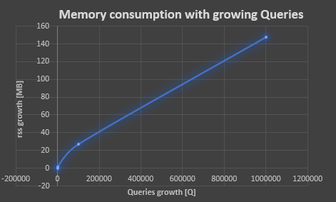
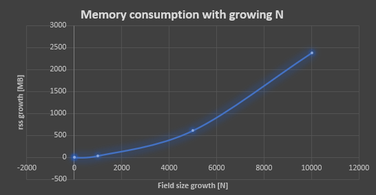

## First task

John is a strawberry farmer. Each year he sells parts of his field
to customers to harvest, for a fixed price based on size of the part they asked for.
He used a simple deduction, where he assumed that all parts of the field
have the same yield. Year by a year, the number of his customers grew and John
began to question his deduction. Is he actually asking enough for the different
parts of his field? He started to mark yields of each and every part of the field.
Since his strawberry fields are huge, he is not able to calculate the yield
of different parts effectively and all by himself. He asked you to create an algorithm,
that will help him figure out the yields of different parts of the field that
the customers are asking for.

### Task definition

Your task is to write an algorithm that will help John calculate
yields of different parts of his field. You will receive size of his field,
yield for each part of his field and queries for each customer with part of the field
he wants to harvest. For each customer query, you should return the expected
yield for given part of the field. Expected yield is represented by a sum of
yields for given part of a field. The part customer asks for is always of
a rectangular shape.

As a part of your solution, you should explain the basic idea of your algorithm
along with the memory and time complexity of your solution. Focus on optimizing
query time.

### Input format

First row of input consists of 2 numbers, **N** - size of strawberry field,
which is always a square of size N*N,
and **Q** - number of queries on input.
Next **N** rows represent the strawberry field.
After that, **Q** rows follow, each consisting of 4 integers
**a**, **b**, **c**, **d**, representing the part of field,
John wants to know the yield of.

### Constraints

- **N** will be between 3 and 10_000, inclusive.
- **Q** will be between 1 and 1_000_000, inclusive.
- **a**, **b**, **c**, **d** will be less than or equal to **N**.
- **a** will be less than or equal to **c**
- **b** will be less than or equal to **d**

### Example

Input

```text
7 3
1 2 3 4 5 6 7
8 9 1 2 3 4 5
6 7 8 9 1 2 3
4 5 6 7 8 9 1
2 3 4 5 6 7 8
9 1 2 3 4 5 6
7 8 9 1 2 3 4
1 1 7 7
3 3 3 3
4 2 6 2
```

Output

```text
235
8
9
```

Since query _1 1 7 7_ represents the whole field,
result of the first query is the sum of the whole field, which is 235.
Second query represents an exact position of 3 3, and the yield on
that part of the field is 8.
The third query result is 9 since the yields in that part equal to 5, 3 and 1.

### Your solution description of first task

My solution is based on usage of *Summed-area table*f algorithm.

#### Time complexity

Computation consits of 3 main steps:
1. Generating integral Image -> time complexity O(N^2)
2. Generating list of queries -> time complexity O(N)
3. Generating results from queries -> time complexity O(N)
```text
N = 100
Q = 100
┌─────────┬───────────────────────────────────┬──────────────────┬─────────────┬─────────────────┐
│ (index) │               task                │ quantityOfInputs │ elapsedTime │   memoryUsage   │
├─────────┼───────────────────────────────────┼──────────────────┼─────────────┼─────────────────┤
│    0    │    'Generating integral Image'    │    '100 [N]'     │   '7 ms'    │ '2277376 bytes' │
│    1    │   'Generating list of queries'    │    '100 [Q]'     │   '0 ms'    │  '86016 bytes'  │
│    2    │ 'Generating results from queries' │    '100 [Q]'     │   '0 ms'    │  '4096 bytes'   │
└─────────┴───────────────────────────────────┴──────────────────┴─────────────┴─────────────────┘
N = 1 000
Q = 1 000
┌─────────┬───────────────────────────────────┬──────────────────┬─────────────┬──────────────────┐
│ (index) │               task                │ quantityOfInputs │ elapsedTime │   memoryUsage    │
├─────────┼───────────────────────────────────┼──────────────────┼─────────────┼──────────────────┤
│    0    │    'Generating integral Image'    │    '1000 [N]'    │   '66 ms'   │ '41922560 bytes' │
│    1    │   'Generating list of queries'    │    '1000 [Q]'    │   '2 ms'    │  '20480 bytes'   │
│    2    │ 'Generating results from queries' │    '1000 [Q]'    │   '1 ms'    │   '4096 bytes'   │
└─────────┴───────────────────────────────────┴──────────────────┴─────────────┴──────────────────┘

N = 10 000
Q = 10 000
┌─────────┬───────────────────────────────────┬──────────────────┬─────────────┐
│ (index) │               task                │ quantityOfInputs │ elapsedTime │
├─────────┼───────────────────────────────────┼──────────────────┼─────────────┤
│    0    │    'Generating integral Image'    │   '10000 [N]'    │ '22592 ms'  │
│    1    │   'Generating list of queries'    │   '10000 [Q]'    │   '30 ms'   │
│    2    │ 'Generating results from queries' │   '10000 [Q]'    │   '16 ms'   │
└─────────┴───────────────────────────────────┴──────────────────┴─────────────┘
```
#### Memory complexity

Based on tests below we can assume:

1. With growing number of inputs Q, memory consumption grows linearly => O(N).
2. With growing number of inputs N, memory consumption grows expo exponentially => O(N^2) (curve is getting steeper).

<p align="center">
  
</p>

<details><summary>**Memory consumption for growing QUERIES**</summary>

```text
N = 10
Q = 1
┌─────────┬────────────────┬─────────────┐
│ (index) │    whatUsed    │  usageInMb  │
├─────────┼────────────────┼─────────────┤
│    0    │     'rss'      │ '20.29 MB.' │
│    1    │  'heapTotal'   │  '4.2 MB.'  │
│    2    │   'heapUsed'   │ '3.61 MB.'  │
│    3    │   'external'   │ '0.37 MB.'  │
│    4    │ 'arrayBuffers' │ '0.01 MB.'  │
└─────────┴────────────────┴─────────────┘
N = 10
Q = 1 000 // + ­­ 1 MB
┌─────────┬────────────────┬────────────┐
│ (index) │    whatUsed    │ usageInMb  │
├─────────┼────────────────┼────────────┤
│    0    │     'rss'      │ '21.4 MB.' │
│    1    │  'heapTotal'   │ '5.2 MB.'  │
│    2    │   'heapUsed'   │ '3.65 MB.' │
│    3    │   'external'   │ '0.37 MB.' │
│    4    │ 'arrayBuffers' │ '0.01 MB.' │
└─────────┴────────────────┴────────────┘
N = 10
Q = 100 000 // +  27 MB
┌─────────┬────────────────┬─────────────┐
│ (index) │    whatUsed    │  usageInMb  │
├─────────┼────────────────┼─────────────┤
│    0    │     'rss'      │ '47.32 MB.' │
│    1    │  'heapTotal'   │ '46.63 MB.' │
│    2    │   'heapUsed'   │ '15.64 MB.' │
│    3    │   'external'   │ '0.37 MB.'  │
│    4    │ 'arrayBuffers' │ '0.01 MB.'  │
└─────────┴────────────────┴─────────────┘
N = 10
Q = 1 000 000 // +  148 MB
┌─────────┬────────────────┬──────────────┐
│ (index) │    whatUsed    │  usageInMb   │
├─────────┼────────────────┼──────────────┤
│    0    │     'rss'      │ '168.93 MB.' │
│    1    │  'heapTotal'   │ '151.07 MB.' │
│    2    │   'heapUsed'   │ '116.76 MB.' │
│    3    │   'external'   │  '0.37 MB.'  │
│    4    │ 'arrayBuffers' │  '0.01 MB.'  │
└─────────┴────────────────┴──────────────┘
```

</details>

<p align="center">
  
</p>

<details><summary>**Memory consumption for growing FIELD**</summary>

```text
N = 3
Q = 10
┌─────────┬────────────────┬────────────┐
│ (index) │    whatUsed    │ usageInMb  │
├─────────┼────────────────┼────────────┤
│    0    │     'rss'      │ '20.2 MB.' │
│    1    │  'heapTotal'   │ '4.2 MB.'  │
│    2    │   'heapUsed'   │ '3.61 MB.' │
│    3    │   'external'   │ '0.37 MB.' │
│    4    │ 'arrayBuffers' │ '0.01 MB.' │
└─────────┴────────────────┴────────────┘
N = 10 // + 0.05 MB
Q = 10
┌─────────┬────────────────┬─────────────┐
│ (index) │    whatUsed    │  usageInMb  │
├─────────┼────────────────┼─────────────┤
│    0    │     'rss'      │ '20.25 MB.' │
│    1    │  'heapTotal'   │  '4.2 MB.'  │
│    2    │   'heapUsed'   │ '3.61 MB.'  │
│    3    │   'external'   │ '0.37 MB.'  │
│    4    │ 'arrayBuffers' │ '0.01 MB.'  │
└─────────┴────────────────┴─────────────┘
N = 1 000 // + ­­ 38 MB
Q = 10 
┌─────────┬────────────────┬─────────────┐
│ (index) │    whatUsed    │  usageInMb  │
├─────────┼────────────────┼─────────────┤
│    0    │     'rss'      │ '58.08 MB.' │
│    1    │  'heapTotal'   │ '57.33 MB.' │
│    2    │   'heapUsed'   │ '26.36 MB.' │
│    3    │   'external'   │ '0.37 MB.'  │
│    4    │ 'arrayBuffers' │ '0.01 MB.'  │
└─────────┴────────────────┴─────────────┘
N = 5 000 // + ­­ 614 MB
Q = 10 
┌─────────┬────────────────┬──────────────┐
│ (index) │    whatUsed    │  usageInMb   │
├─────────┼────────────────┼──────────────┤
│    0    │     'rss'      │ '634.71 MB.' │
│    1    │  'heapTotal'   │ '642.69 MB.' │
│    2    │   'heapUsed'   │ '575.88 MB.' │
│    3    │   'external'   │  '0.37 MB.'  │
│    4    │ 'arrayBuffers' │  '0.01 MB.'  │
└─────────┴────────────────┴──────────────┘
N = 10 000 // + ­­ 2363 MB
Q = 10 
┌─────────┬────────────────┬───────────────┐
│ (index) │    whatUsed    │   usageInMb   │
├─────────┼────────────────┼───────────────┤
│    0    │     'rss'      │ '2383.86 MB.' │
│    1    │  'heapTotal'   │ '2462.64 MB.' │
│    2    │   'heapUsed'   │ '2293.44 MB.' │
│    3    │   'external'   │  '0.37 MB.'   │
│    4    │ 'arrayBuffers' │  '0.01 MB.'   │
└─────────┴────────────────┴───────────────┘
```

</details>


#### Try out solution

If you want to try out this solution run *main.js* and manipulate *strawberryFieldLength* and *amountOfQueries* input.

**main.js**

```javascript
const strawberryFieldLength = 100; // N, lenght of field => Area = N*N
const amountOfQueries = 100; // Q
```

**Init app:**

Simply place following command into your terminal (run this command from root directory):

```text
$ start-first-task
```

**Unit tests:**

In oredeMake sure Jest is between your devDependecies by typing following command into your terminal:

```text
$ npm install --save-Dev jest
```

Then you can run unit tests with:

```text
$ npm run test
```

